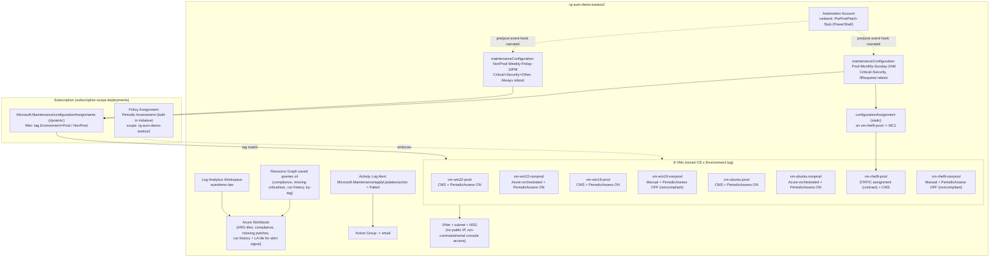

# Azure Update Manager Demo — Plan

Self-contained, Bicep-deployable Azure Update Manager demo environment for a live technical demo.
Everything lives in one resource group and is deletable with one command.

- Tenant: `46d3e391-bd8a-44cb-a6f7-10ff4b3405ef`
- Subscription: `c69f7b0e-bf5b-4e01-b8c9-5a9fd00dae85`
- Region: `eastus2`
- Resource group: `rg-aum-demo-eastus2`
- Prefix: `aumdemo`
- Cost target: < $25/day while VMs are running

## Architecture



## Resource inventory

| Resource | Purpose | SKU/Size | Est. cost/day |
|---|---|---|---|
| vm-win22-prod / vm-win22-nonprod | Win2022 Datacenter Azure Edition — CMS vs Azure-orchestrated demo | Standard_B2s | ~$2.90 each |
| vm-win19-prod / vm-win19-nonprod | Win2019 Datacenter — CMS vs Manual demo | Standard_B2s | ~$2.90 each |
| vm-ubuntu-prod / vm-ubuntu-nonprod | Ubuntu 22.04 LTS — CMS vs Azure-orchestrated demo | Standard_B2s | ~$1.00 each |
| vm-rhel9-prod / vm-rhel9-nonprod | RHEL 9 PAYG — static assignment vs Manual demo | Standard_B2s | ~$3.10 each |
| VNet + subnet + NSG | Network isolation, no public IPs | n/a | ~$0 |
| Managed disks (8x OS disk) | VM OS disks | Standard SSD | ~$0.60 each |
| Log Analytics workspace | Alert query signal + optional VM logs | PerGB2018, 30-day retention | ~$0.10–0.50 |
| Azure Workbook | Reporting UI (ARG + LA tiles) | n/a | $0 |
| 4x Resource Graph saved queries | Compliance / missing critical-security / patch run history / by-tag rollup | n/a | $0 |
| Automation Account + 1 runbook | Pre/post patch stub — clearly labeled, not wired to a real app | Free tier | $0 |
| 2x maintenanceConfiguration | Prod-Monthly-Sunday-2AM, NonProd-Weekly-Friday-10PM | n/a | $0 |
| Dynamic + static configurationAssignments | Tag-based scoping + one static VM assignment | n/a | $0 |
| Policy assignment (built-in periodic assessment initiative) | Enforce assessment at scale | n/a | $0 |
| Action group + Activity Log alert | Notify on failed patch install | n/a | ~$0.10 |
| **Total (8 VMs running full day)** | | | **~$21–26/day** — tight vs. target, see Risks |

## Repo structure

```
aum-demo/
  PLAN.md
  README.md
  LICENSE
  .gitignore
  .github/workflows/validate-bicep.yml
  bicep/
    main.bicep
    main.bicepparam
    modules/
      network.bicep
      loganalytics.bicep
      automation.bicep
      vm-windows.bicep
      vm-linux.bicep
      maintenance-configs.bicep
      dynamic-scope-assignment.bicep
      static-scope-assignment.bicep
      policy-periodic-assessment.bicep
      workbook.bicep
      resourcegraph-queries.bicep
      alerting.bicep
  automation/
    PrePostPatch-Stub.ps1
  scripts/
    preflight-checks.ps1
    deploy.ps1
    seed-noncompliance.ps1
    teardown.ps1
  docs/
    demo-script.md
    real-vs-simulated.md
    troubleshooting.md
```

## Bicep module decomposition & dependency order

1. `main.bicep` (subscription scope) creates the resource group directly (`Microsoft.Resources/resourceGroups`).
2. *(resourceGroup scope, parallel)* `network.bicep`, `loganalytics.bicep`, `automation.bicep` — no interdependency.
3. *(resourceGroup scope, depends on 2-network)* `vm-windows.bicep` x4, `vm-linux.bicep` x4 — need subnet ID.
4. *(resourceGroup scope, no VM dependency, parallel with 3)* `maintenance-configs.bicep`.
5. *(subscription scope, depends on 4)* `dynamic-scope-assignment.bicep` — needs maintenanceConfiguration resource IDs.
6. *(resourceGroup scope, depends on 3 + 4)* `static-scope-assignment.bicep` — needs vm-rhel9-prod ID + Prod-Monthly config ID.
7. *(resourceGroup scope, depends on 3)* `policy-periodic-assessment.bicep` — assigned after VMs exist so remediation has a target.
8. *(subscription scope, depends on 3)* `resourcegraph-queries.bicep` — query correctness depends on VMs existing.
9. *(resourceGroup scope, depends on 2-loganalytics)* `workbook.bicep`.
10. *(resourceGroup scope, independent)* `alerting.bicep`.

## Deployment sequence & estimated wall-clock

| Step | Action | Est. time |
|---|---|---|
| 0 | `scripts/preflight-checks.ps1` — quota, provider registration, RHEL PAYG terms | 2 min |
| 1 | `az deployment sub create` — RG + network + LAW + automation account | 3–4 min |
| 2 | VM modules (8x, parallel) | 8–12 min |
| 3 | Maintenance configs + policy assignment | 2–3 min |
| 4 | Dynamic + static configuration assignments | 1–2 min |
| 5 | Workbook + Resource Graph saved queries + alerting | 2 min |
| 6 | `scripts/seed-noncompliance.ps1` — trigger assessment on select VMs | 5–10 min (async) |
| **Total** | | **~25–35 min — run the night before, not day-of** |

## Demo seeding strategy

- Pick marketplace image versions 1–2 releases behind current (older RHEL 9.x / Ubuntu 22.04 LTS build / Windows Server image date) so pending updates genuinely exist at boot — no fabricated data.
- Trigger periodic assessment immediately on Prod VMs only, right after provisioning.
- Leave `vm-win19-nonprod` and `vm-rhel9-nonprod` on `ImageDefault`/manual assessment so they show "Unknown"/stale compliance — a legitimate, real contrast.
- Do not pre-patch at least 2 VMs before the demo — this naturally yields "Critical/Security pending" tiles.
- Assessment latency can be 10–15 minutes — seeding must happen the night before, never live during the 45-minute window.

## Risks, prerequisites, quota, fallback (T-20 min)

- **Quota**: confirm `Standard BSv2/BS Family vCPUs` ≥ 16 in eastus2 (8x B2s = 16 vCPU). Check with `az vm list-usage`.
- **RHEL PAYG terms**: accept marketplace terms before deployment (`az vm image terms accept`) or VM create fails.
- **Provider registration**: `Microsoft.Maintenance`, `Microsoft.HybridCompute` (narration only), `Microsoft.PolicyInsights`, `Microsoft.ResourceGraph` must be registered.
- **Cost risk**: 8 VMs running a full day is ~$21–26/day — at/above target. Stop-deallocate VMs outside rehearsal/demo windows; do not leave running overnight.
- **Assessment latency**: if compliance data hasn't populated by demo time, fall back to pre-captured workbook screenshots as a labeled contingency slide — never presented as live data.
- **Policy remediation lag**: DINE remediation can take 10+ minutes; if not converged, show "assignment created, remediation in progress" rather than claiming enforcement already happened.
- **VM provisioning failure**: keep the demo narratable with 7 VMs if one fails; do not block on a live redeploy during the window.

## What's real vs. simulated

| Claim | Status |
|---|---|
| Update compliance assessment, patch install, schedules, dynamic/static scope, policy enforcement | **Real** — live Azure Update Manager behavior |
| Windows/Linux mixed-OS patching | **Real** |
| Hybrid/Arc-managed servers | **Simulated** — Azure VMs tagged to represent on-prem/Arc; narrated explicitly as not deployed here |
| Pre/post maintenance "app-aware" automation | **Simulated stub** — Automation runbook is a placeholder, not integrated with a real app |
| Extended Security Updates, hotpatching | **Not deployed** — talk-track only |
| Reporting workbook | **Real data** — sourced from Azure Resource Graph (Update Manager's actual backing store), blended with Log Analytics for the alert signal, not the legacy Log Analytics Update Management solution |

## Decisions locked in

- 8 VMs total (2 per OS: Prod + NonProd). `vm-rhel9-prod` carries a Prod tag for narration *and* a static `configurationAssignment`, explicitly contrasting with the other 7 VMs' dynamic tag-based scoping.
- Pre/post maintenance stub = Automation Account runbook (PowerShell) — cheaper and simpler than an Azure Function.
- RHEL 9 uses the PAYG marketplace image — no BYOS activation key dependency.
- Alert action group notifies an email address supplied as a deployment parameter (plain string, not a secret).
- No public IPs / Bastion by default — access via `az vm run-command` or Serial Console. Bastion Basic can be added later behind a parameter flag if interactive RDP/SSH is needed.
