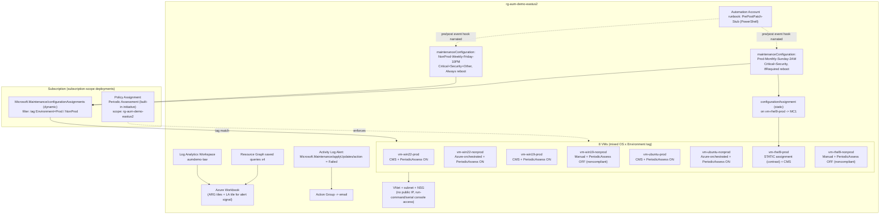

# Azure Update Manager Demo

A self-contained, Bicep-deployable demo environment for **Azure Update Manager**: mixed-OS
compliance reporting, Customer Managed Schedules vs. Azure-orchestrated vs. Manual patch
orchestration, scheduled maintenance with dynamic and static scoping, policy-enforced periodic
assessment, and Azure-Resource-Graph-backed reporting — all in one resource group, deletable with
one command.

> **⚠️ Disclaimer:** This repository is a **live-demo / proof-of-concept environment**, not a
> production reference architecture. It intentionally trades off HA, backup, private networking,
> and hardening for cost and setup speed. It is **not affiliated with, endorsed by, or built for
> any specific customer** — names, tags, and schedules are generic placeholders. Review
> [docs/real-vs-simulated.md](docs/real-vs-simulated.md) before presenting it to anyone.

See [PLAN.md](PLAN.md) for the full architecture rationale, resource inventory, deployment
sequence, demo seeding strategy, and risk/fallback plan.

## Architecture



## Prerequisites

- Azure CLI >= 2.60 with the Bicep CLI (`az bicep install`)
- Owner (or Contributor + User Access Administrator) on the target subscription
- PowerShell 7+ (scripts are written for `pwsh`/Windows PowerShell 5.1)
- Logged in: `az login --tenant 46d3e391-bd8a-44cb-a6f7-10ff4b3405ef`
- Subscription set: `az account set --subscription c69f7b0e-bf5b-4e01-b8c9-5a9fd00dae85`

## Quickstart

```powershell
./scripts/preflight-checks.ps1     # 1. verify quota, provider registration, marketplace terms
./scripts/deploy.ps1                # 2. deploy everything (prompts for credentials + alert email)
./scripts/seed-noncompliance.ps1    # 3. trigger assessments so compliance data shows before the demo
```

Run step 3 the night before your demo — Update Manager assessment is asynchronous and can take
10–15 minutes to populate.

No secrets are stored in this repo. VM credentials are supplied interactively at deploy time
(`@secure()` parameters sourced from environment variables) — see
[bicep/main.bicepparam](bicep/main.bicepparam) for the pattern, or substitute an Azure Key Vault
reference for production-adjacent use.

## Parameter reference

| Parameter | Type | Default | Description |
|---|---|---|---|
| `location` | string | `eastus2` | Azure region for all resources |
| `resourceGroupName` | string | `rg-aum-demo-eastus2` | Target resource group (created by the deployment) |
| `namePrefix` | string | `aumdemo` | Prefix applied to generated resource names |
| `tags` | object | `{ Project, Owner, CostCenter }` | Tags applied to all resources |
| `adminUsername` | string | *(required)* | Local administrator username for all VMs |
| `adminPassword` | `@secure()` string | *(required)* | Windows admin password / Linux password-auth fallback |
| `sshPublicKey` | `@secure()` string | `''` | SSH public key for Linux VMs when `linuxAuthenticationType = sshPublicKey` |
| `linuxAuthenticationType` | string | `sshPublicKey` | `sshPublicKey` or `password` |
| `alertEmail` | string | *(required)* | Notification target for the failed-patch-install alert |
| `vmSize` | string | `Standard_B2s` | VM size for all 8 demo VMs |
| `windowsImageVersion` | string | `latest` | Pin to an older build so pending updates exist for the demo |
| `ubuntuImageVersion` | string | `latest` | Pin to an older build so pending updates exist for the demo |
| `rhelImageVersion` | string | `latest` | Pin to an older build so pending updates exist for the demo |

## Cost estimate

~$21–26/day while all 8 VMs are running (see [PLAN.md](PLAN.md) for the per-resource breakdown).
Everything else (maintenance configs, policy, alerting, workbook, Resource Graph queries) is free
or near-free. **Stop-deallocate or delete VMs outside your rehearsal/demo window** to stay under
budget — see teardown below.

## Teardown

```powershell
./scripts/teardown.ps1
```

Deletes the entire `rg-aum-demo-eastus2` resource group after a typed confirmation. See
[docs/TEARDOWN.md](docs/TEARDOWN.md) for partial-teardown (stop VMs only) and verification steps.

## Repo layout

- `bicep/` — Bicep modules and orchestrator (`main.bicep`)
- `automation/` — Automation Account runbook stub source
- `scripts/` — deployment, seeding, teardown, and preflight scripts
- `docs/` — demo talk track, architecture detail, troubleshooting, teardown, real-vs-simulated matrix
- `.github/workflows/` — CI validation (Bicep build + what-if) on pull requests

## Contributing

See [CONTRIBUTING.md](CONTRIBUTING.md) for branch conventions and how to propose changes.
