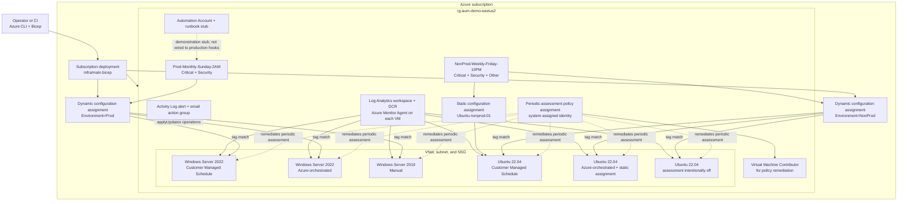

# Architecture

This document describes the implementation under `infra/`, which is the deployment path used by
the PowerShell and Bash scripts. The older `bicep/` tree remains as an expanded reference
implementation and is compiled in CI, but it is not invoked by `scripts/deploy.ps1`.

## System diagram

## Deployment scopes and dependency order

| Order | Scope | Component | Dependency and reason |
|---|---|---|---|
| 1 | Subscription | Resource group | A subscription deployment is required to create the target resource group. |
| 2 | Resource group | Network, maintenance configurations, alerting, Automation | These resources have no VM dependency and can deploy in parallel. |
| 3 | Resource group | Six VMs and Azure Monitor Agent extensions | NICs depend on the subnet; the VMs are otherwise parallel. |
| 4 | Resource group | Log Analytics workspace, DCR, and associations | Associations require the VM resource IDs. |
| 5 | Subscription | Two dynamic configuration assignments | Azure Update Manager dynamic scopes are subscription resources and require maintenance configuration IDs. |
| 6 | VM child resource | Static configuration assignment | Demonstrates direct assignment and requires both the VM and maintenance configuration. |
| 7 | Resource group | Policy assignment, role assignment, remediation | The identity and role allow the deploy-if-not-exists policy to configure periodic assessment. |

## Design decisions

### Subscription-scope orchestrator

`infra/main.bicep` targets the subscription because it must create both the resource group and
subscription-level dynamic maintenance assignments. A single entry point gives a cold deployment
one dependency graph and one set of outputs. The teardown scripts reverse this order by deleting
subscription resources before the resource group.

### Six small VMs instead of a production topology

Three Windows and three Ubuntu `Standard_B2s` VMs provide enough variation to show customer-managed
schedules, Azure orchestration, manual patching, and an intentionally stale assessment state. They
use Standard SSD OS disks and no application workload. This keeps the demo understandable and
inexpensive; it is not a resiliency or capacity reference architecture.

### Dynamic tags plus one static assignment

The `Environment` tag drives the Prod and NonProd dynamic scopes, demonstrating how fleets can join
a schedule without changing Bicep. One explicit VM child assignment provides a visible comparison
for exceptions. Dynamic assignments live outside the resource group, so deleting only the group is
insufficient.

### Policy remediation with a managed identity

The built-in periodic-assessment policy is assigned at resource-group scope with a system-assigned
identity. That identity receives `Virtual Machine Contributor` only at the demo resource group,
rather than at subscription scope. This is the minimum scope needed by the remediation. Teardown
captures and deletes the identity's role assignments before deleting the policy assignment.

### Network isolation

VMs have private NICs and no public IPs. The NSG accepts management traffic only from the CIDR
provided at deployment; Azure Bastion Developer is optional. This reduces accidental exposure
without introducing production-grade private endpoints, firewalls, or hub-and-spoke dependencies.

### Update Manager data stays in Resource Graph

Azure Update Manager assessment and installation results are authoritative in Azure Resource Graph.
The Log Analytics workspace, DCR, and Azure Monitor Agents demonstrate adjacent operational
telemetry; they are not presented as the source of Update Manager compliance. The seeding script
adds reusable KQL searches, but the `Update` table may remain empty unless legacy update data is
separately connected.

### Portal workbook and pre/post task are demonstrations

The current `infra/` deployment intentionally does not deploy a shared workbook because the
first-party Update Manager workbook is available in the portal and has changed independently of
the resource API. The Automation runbook is also a clearly labeled stub, not a production event
handler. These choices avoid implying that a demo visualization or no-op hook is operational
automation.

## Security and operational boundaries

- Credentials enter through environment variables or an interactive secure prompt and are never
  written to repository files.
- Trusted Launch, secure boot, vTPM, managed identities, and boot diagnostics are enabled.
- The environment intentionally omits backup, availability zones, private endpoints, centralized
  egress, update rings, and workload-aware health checks.
- Maintenance windows use `Eastern Standard Time`; change the parameter file when reproducing in
  another operating region.

See [README.md](../README.md) for deployment instructions, [TROUBLESHOOTING.md](TROUBLESHOOTING.md)
for operational failures, and [TEARDOWN.md](TEARDOWN.md) for the complete deletion order.
